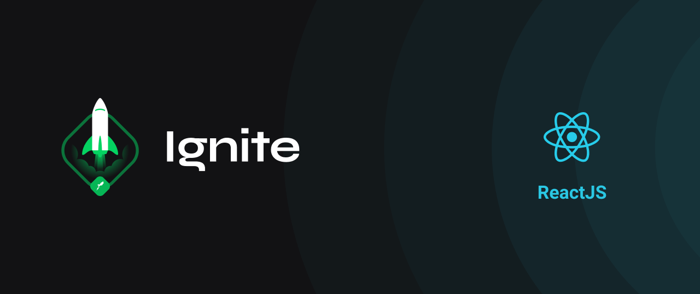

<div align="center" id="top"> 
  

&#xa0;

</div>

<h1 align="center">GORestaurant -  Refactoring de classes e typescript</h1>

<p align="center">
  

  

</p>

<p align="center">
  <a href="#dart-sobre-o-desafio">Sobre</a> &#xa0; | &#xa0; 
   <a href="#rocket-tecnologias">Tecnologias</a> &#xa0; | &#xa0;
  <a href="#white_check_mark-pré-requesitos">Pré requisitos</a> &#xa0; | &#xa0;
  <a href="#checkered_flag-começando">Começando</a> &#xa0; | &#xa0;
  <a href="#thinking-como-contribuir">Como contribuir</a> &#xa0; | &#xa0;
  <a href="#memo-licença">Licença</a> &#xa0; | &#xa0;
  <a href="https://github.com/brunowbbs" target="_blank">Autor</a>
</p>
 
 &#xa0;

 <p align="center">
 
 </p>
<br>

## :dart: Sobre o desafio

Desafio 2 do módulo 2 da trilha de ReactJS da Rocketseat, essa será uma aplicação já funcional onde o seu principal objetivo é realizar dois processos de migração: de Javascript para Typescript e de Class Components para Function Components.,

&#xa0;

## :rocket: Tecnologias

As seguintes ferramentas foram usadas na construção do projeto:

- [Styled Components](https://styled-components.com/)
- [Node.js](https://nodejs.org/pt-br/)
- [ReactJS](https://reactjs.org/)
- [Typescript](https://www.typescriptlang.org/)
  &#xa0;

## :white_check_mark: Pré requisitos

Antes de começar :checkered_flag:, você precisa ter o [Git](https://git-scm.com) e o [Node](https://nodejs.org/en/) instalados em sua maquina.

&#xa0;

## :checkered_flag: Começando

```bash
# Clone este repositório
$ git clone https://github.com/brunowbbs/Desafio-04---Refactoring-Class-ts.git

 # Instale as dependências
 $ yarn install ou
 $ npm i

 # A aplicação simula uma Fake API através da utilização do json-server, assim é necessário startá-la
 $ npm server
 $ yarn server

 # Execute a aplicação em modo de desenvolvimento
 $ npm start
 $ yarn start

 # O servidor iniciará na porta:3000
 # Acesse http://localhost:3000
```

&#xa0;

## :thinking: Como contribuir

- Faça um fork desse repositório;
- Cria uma branch com a sua feature: `git checkout -b minha-feature`;
- Faça commit das suas alterações: `git commit -m 'feat: Minha nova feature'`;
- Faça push para a sua branch: `git push origin minha-feature`.

Depois que o merge da sua pull request for feito, você pode deletar a sua branch.

&#xa0;

## :memo: Licença

Este projeto está sob licença MIT. Veja o arquivo [LICENSE](LICENSE.md) para mais detalhes.

Feito com :heart: por <a href="https://github.com/brunowbbs" target="_blank">Wesley Bruno</a>

&#xa0;

<p align="right">(<a href="#top">Voltar para o topo</a>)</p>
